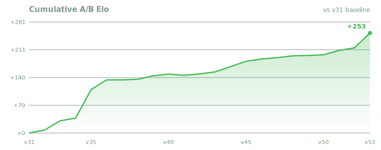
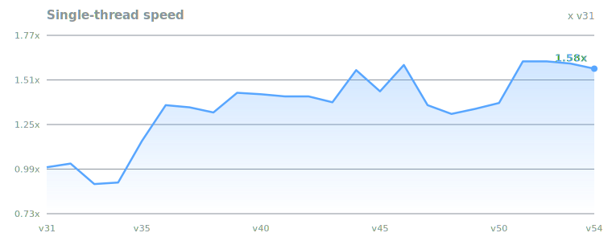
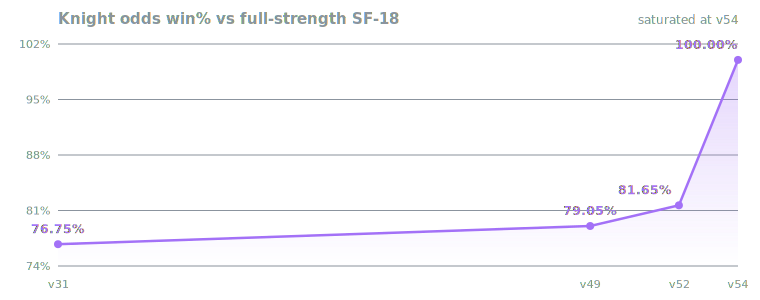
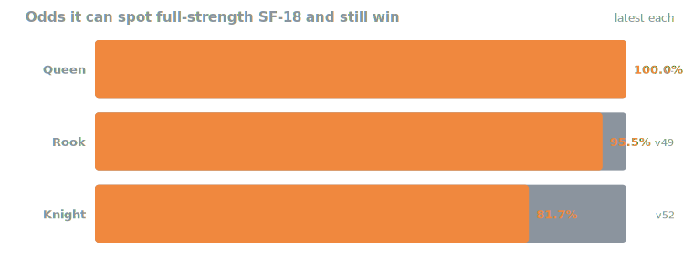

<div align="center">

# Pygin

**A from-scratch chess engine in Python + C** — hand-written search and
evaluation, no NNUE, no external engine.<br/>
[`python-chess`](https://pypi.org/project/chess/) is used *only* for board
representation, move generation and legality.


&nbsp;·&nbsp; Built with **[Claude Code](https://claude.com/claude-code)**

</div>

### At a glance

| | | | |
|---|---|---|---|
| 🏆 **~2885 Elo** | SF-18 UCI_Elo bracket | ⚡ **3.8M nps** | 14.9M at 4 threads |
| 🧪 **+284 Elo** | A/B-confirmed, v31→v54 | 📈 **~18 ply** | from startpos in 5 s |
| 🥇 **v53+v54** eval lane | +37.52 & +31.20, the two biggest | 📚 **1 dependency** | `python-chess` only |

<table>
<tr>
<td></td>
<td></td>
</tr>
<tr>
<td></td>
<td></td>
</tr>
</table>

- **Top row — self-play.** Every C-era version (v31+) is A/B-tested against the
  one before it: gains stacked (**+284 Elo**) and single-thread speed (**1.61×**).
  The v30→v31 C rewrite (~34× faster, +215 odds-derived) is off the left edge,
  so v31 is the honest zero.
- **Bottom row — vs Stockfish 18 at full strength.** The external check: knight
  odds climbed **76.75 → 100%** (v31 → v54) and closed, with **pawn odds**
  (84.9%) taking over as the live rung, and the handicap
  ladder — it spots SF a **queen** (100%), **rook** (95.5%), **knight** (100%)
  or **pawn** (84.9%) and still wins. Pawn odds is the only rung with headroom
  left, so it is the yardstick now.

### Two engines, one eval

- **`cengine.py` + `csearch.c`** — the **C search core**, the strongest engine.
  The *whole* per-node loop runs in C (board, ordering, TT, pruning, quiescence,
  bit-exact eval). Python keeps only the root: iterative deepening, time
  management, book. **~50× the Python core.**
- **`engine.py`** — the reference Python engine and the **single source of eval
  truth**: the C core reads every eval parameter from it at startup.

### Measured strength

- **~2885 Elo** — SF-18 UCI_Elo bracket (v51): **62.5%** over the 2850 cap,
  **46.4%** under 2900, 2,000 games each. A class bracket, not a rating.
- **Odds vs full-strength SF-18** — the external yardstick. Knight odds ran
  76.75% → 79.05% → 81.65% → **100%** (v31 → v49 → v52 → v54) and is now
  **saturated** — the PST candidate that shipped as v54 took 197 games without
  conceding a single win or draw. Queen (100%) and rook (95.5%) went the
  same way. **Pawn odds (f2)** is the active rung: **84.88%** over 2,000 games
  at v54 (+299.63 ±29.8, 1531–333–136), the one handicap SF still scores against.
- **vs its own Python engine: 1,815–0–40.** No rating quoted — the gap is past
  what Elo can express. The Python engine alone is **~2440–2450** (level with
  SF-18 at UCI_Elo 2450).

---

## Version progression

- **54 versions**, each A/B-tested against the one before it.
- Speed = nodes/s and depth from **startpos in 5 s** (book off, best-of-N).
- **`Elo Δ`** = A/B vs the previous version. **Cumulative ≈ +284 over v31.**
- Full per-version speed/depth/Elo is in the collapsible list below; the
  charts above summarise it. Regenerate: `bench_progress.py`, `make_readme_charts.py`.

<details>
<summary><b>Every version in full</b> — complete milestone + Elo list</summary>

- **v54** — **PST retune** (736 piece-square entries fitted for the first time, texel.py --pst, 735 values moved; GSPRT[0,2] LLR +7.806, 11.7k games — second-largest release) *(**+31.20 ±5.6**)*
- **v53** — **Texel eval retune** (44 scalars refitted on 4M own-self-play positions, game-result labels; fourth SPRT accept, LLR +9.918, 12k pooled games — largest single release) *(**+37.52 ±6.3**)*
- **v52** — null-move refinements (no double null + eval-scaled R; third SPRT accept, 12k pooled games) *(+6.63 ±4.5)*
- **v51** — root-move LMR (late quiet root scouts reduced; second SPRT accept, 9.3k pooled games) *(+11.12 ±5.3)*
- **v50** — rule50 TT staleness guard + depth-independent TT mate handling (permanent terminal entries; null kept as correctness) *(+1.60 ±6.8)*
- **v49** — cuckoo upcoming-repetition (forcible draw scored one ply early; null kept as correctness) *(+0.97 ±6.8)*
- **v48** — qsearch TT-quality batch (TT value sharpens stand-pat; first SPRT accept, 21.6k games) *(+4.73 ±3.2)*
- **v47** — TT to 192 MB (diminishing) + MultiPV (node-exact off) *(+3.16 ±6.8)*
- **v46** — transposition table doubled to 96 MB (borderline; less TT thrash per game) *(+5.94 ±6.8)*
- **v45** — TT search value sharpens the pruning eval (same NPS, smarter cuts) *(+13.52 ±6.8)*
- **v44** — TT prefetch (node-identical, +5–6 % NPS) *(+13.31 ±6.8)*
- **v43** — verified-null REMOVED (the insurance cost ~1 ply; isolation A/B) *(+5.18 ±6.8)*
- **v42** — cannot-win eval clamp (correctness) *(+3.27 ±6.8)*
- **v41** — verified null + 50-move + TT-store policy (correctness) *(−2.88 ±6.8)*
- **v40** — FIDE-exact en-passant hashing (correctness) *(+4.31 ±6.8)*
- **v39** — incremental Zobrist + eval-in-TT + NPS batch *(+8.86 ±6.8)*
- **v38** — score-hygiene batch (correctness) *(+1.36 ±6.8)*
- **v37** — exact PV (correctness) *(+0.17 ±6.8)*
- **v36** — staged move ordering *(+24.67 ±6.8)*
- **v35** — noisy-only qsearch gen + qsearch TT *(≈ +72)*
- **v34** — check extensions *(+6.81 ±6.8)*
- **v33** — transposition table kept warm across moves *(+23.52 ±6.8)*
- **v32** — internal iterative reduction *(+7.30 ±6.8)*
- **v31** — **C search core** (whole per-node loop in C) *(≈ +215 ¹)*
- **v30** — stability-scaled time (U-06); last Python *(+10.91 ±6.8)*
- **v29** — soft-stop time management (P-35) *(+38.34 ±6.9)*
- **v28** — node-identical speed batch (+4 %) *(+13.13 ±6.0)*
- **v27** — node-identical speed batch (+12 %) *(+35.17 ±7.7)*
- **v26** — node-identical speed batch *(+41.90 ±5.7)*
- **v25** — 18-item bug block; Lazy-SMP production fixes *(+2.91 ±11.6)*
- **v24** — TT-dispatch de-branching (± is the v21→v24 span) *(+11.75 ±6.8 ²)*
- **v23** — Zobrist dispatch de-branching (code quality) *(≈ +0 est ²)*
- **v22** — nine correctness bug fixes + six NPS wins *(≈ +8 est ²)*
- **v21** — capture history, SEE capture pruning, LMR losing captures *(+16 ±10 ⁴)*
- **v20** — rook-on-7th, mobility area, threats; one-call C eval *(+45 ±11 ⁴)*
- **v19** — lock-free shared TT, multi-process SMP, packed move word *(≈ +5 est ⁵)*
- **v18** — incremental Zobrist hashing (off by default; SMP infra) *(≈ +0 est ⁵)*
- **v17** — **move generation ported to C** (`movegen.c`) *(+69 ±16 ³)*
- **v16** — **evaluation ported to C** (`eval_c.c`) *((in ³))*
- **v15** — LMR-divisor tune (tie); probcut tried & removed *(≈ +0 est ⁵)*
- **v14** — Syzygy TB probe, internal iterative reduction, pawn hash *(≈ +8 est ⁵)*
- **v13** — eval-weight retune *(≈ +4 est ⁵)*
- **v12** — check-extension budgeting + max-extensions cap *(≈ +4 est ⁵)*
- **v11** — incremental base eval (byte-identical) *(≈ +3 est ⁵)*
- **v10** — TT refactor (two-tier + depth-preferred replacement) *(≈ +8 est ⁵)*
- **v9** — late-move pruning, history malus, improving heuristic *(≈ +12 est ⁵)*
- **v8** — quiescence stand-pat, trade-down simplify, PV extraction *(≈ +12 est ⁵)*
- **v7** — pin evaluation *(≈ +4 est ⁵)*
- **v6** — lone-king endgame eval fix *(≈ +8 est ⁵)*
- **v5** — recapture extension *(≈ +3 est ⁵)*
- **v4** — SEE move ordering + losing-capture pruning *(≈ +20 est ⁵)*
- **v3** — endgame mop-up, contempt draws, counter-moves *(≈ +15 est ⁵)*
- **v2** — search + eval build-out: PVS, futility, LMR, aspiration, pawn/mobility/king-safety eval, book *(≈ +120 est ⁵)*
- **v1** — first working engine (naive negamax + material eval) *(—)*

</details>

<details>
<summary><b>Reading the table</b> (footnotes & caveats)</summary>

- **Elo Δ** — A/B vs the previous version (C-era = 10,000 games). Not summable
  across the whole column: TCs differ (Python era assorted ⁴, v32–36 at 45+0.10,
  v37–47 at 50+0.20, v48+ on `--nodes`).
- **`est` ⁵** — feature-based estimate, not an A/B. The real anchor is ≈2442 by v25.
- **Bundled A/Bs** — v16+v17 vs v15 = +69 ±16 ³; v22–24 vs v21 = +11.75 ±6.8 ²;
  v31's ≈+215 ¹ is odds-derived.
- **NPS 4T** — "—" for v1–24 (no reliable SMP). v25–30 multi-process,
  v31+ pthread Lazy-SMP, so the v30→v31 jump is partly methodology.

</details>

### Milestones that moved the needle

| Jump | NPS | What |
|---|---|---|
| **v15→v17** | 28.7k → 52.7k | eval, then movegen ported to C (byte-identical) |
| **v25→v28** | 49.1k → 69.0k | node-identical speed batches |
| **v30→v31** | 69.0k → **2.34M (~34×)** | whole per-node loop moves to C — *the* jump |
| **v34→v36** | 2.13M → 3.19M | noisy-only qsearch gen + staged ordering |
| **v43→v44** | 3.23M → 3.67M | TT prefetch — **+13.31 Elo**, ~2.7 Elo per 1% NPS |
| **v53** | — | Texel eval retune — **+37.52 Elo**, biggest single release |

*Not visible as NPS:* v39→v40 (ep-key merge) and the v41→v43 verified-null
removal are nodes-to-depth gains at flat speed.

---

## Features

- **Search** — negamax/alpha-beta, PVS, iterative deepening, aspiration windows,
  transposition table, quiescence.
- **Selectivity** — null-move, reverse-futility & futility pruning, LMR + LMP,
  check / single-reply / passed-pawn extensions.
- **Move ordering** — TT move, MVV-LVA + capture history, killers, counter-moves,
  history heuristic, SEE.
- **Evaluation** — tapered HCE (material + PSQT, pawn structure, king safety,
  mobility, rook files, bishop pair, threats, endgame mop-up), ported to C.
- **C internals** — magic-bitboard movegen reproducing python-chess's order
  byte-for-byte; whole per-node search loop in C; bit-exact eval port verified
  over **3M positions**.
- **Lazy SMP** — pthreads + lock-free shared TT (UCI `Threads`); Python engine
  has a multi-process variant.
- **Optional** — bundled Polyglot book (`Perfect2023.bin`), online Syzygy probing.

---

## Setup

```bash
git clone https://github.com/IchNukeDichWeg/Pygin.git
cd Pygin
./setup.sh
```

`setup.sh` installs anything missing (Homebrew on macOS, apt/dnf/pacman/zypper
on Linux), builds the C libraries, best-effort builds the `Old Engine/`
snapshots, and self-tests.

**Needs:** Python 3.10+ · a C compiler (`clang`/`gcc`) · `python-chess` (only
dependency) · Stockfish *(optional, for strength/odds testing)*.

```bash
python3 selftest.py        # health check; exit 0 = OK, chainable
```

> **Isolated install:** `python3 -m venv .venv && source .venv/bin/activate`, then `./setup.sh`.
> **Windows:** build a Unix `.so`, so use [WSL](https://learn.microsoft.com/windows/wsl/install) (`wsl --install`) or Git Bash / MSYS2.
> **Rebuild C by hand:** `python3 eval_build.py && python3 movegen_build.py` (for `csearch.so`, re-run `./setup.sh`).

---

## Running a headless match

`match.py` plays engine-vs-engine, prints a live scoreboard + Elo, and writes a
per-game log and PGN.

```bash
# C search core vs a saved snapshot: 100 games (×2 colours), 4 workers
python3 match.py cengine.py "Old Engine/34/engine34.py" 100 0 --workers 4
```

- **Positional args:** `engine1 engine2 NUM_POSITIONS OFFSET` — each position is
  played both colours, so games = `NUM_POSITIONS × 2`.
- **Flags:** `--workers 0` = cores−1 · `--adj on|off` adjudication ·
  `--sf-elo N` · `--smp N` · `--book1/--book2 PATH` · `--start-pos True`.
- **Openings:** defaults to bundled `UHO_4060_v4.epd`. Larger sets from the
  [Stockfish books repo](https://github.com/official-stockfish/books); point
  `FEN_FILE` at one.

**vs Stockfish** (binary on `PATH`):

```bash
python3 match.py engine.py stockfish_engine.py 100 0 --sf-elo 2000   # 0 = full strength
```

**Material / time odds** — configured in `odds.py`'s `CONFIG` block (default is
pawn odds, `f2`). Each worker runs **two** engines, so use `--workers ≤ cores/2`
so a real clock TC isn't starved by oversubscription:

```bash
python3 odds.py --positions 500 --workers 5
```

---

## UCI options

`cuci.py` is the UCI engine (`setoption name <Option> value <x>`). Standard
GUI options:

| Option | Type | Default | Range | Purpose |
|:-------|:-----|--------:|:------|:--------|
| `Threads` | spin | 1 | 1–256 | Lazy-SMP search threads |
| `Hash` | spin | 192 | 2–6144 | Transposition-table size (MB); resize wipes the table |
| `MultiPV` | spin | 1 | 1–5 | PV lines reported |
| `OwnBook` | check | true | — | Use opening book |
| `BookFile` | string |  | — | Path to Polyglot `.bin` book (empty ⇒ bundled `Perfect2023.bin`) |
| `UseTB` | check | false | — | Probe the online Lichess Syzygy tablebase at the root (needs network; no local path) |
| `Move Overhead` | spin | 40 | 0–5000 | Clock margin (ms) for GUI/network lag |
| `Premove` | check | false | — | Emit certified instant-reply premoves (opt-in) |
| `UCI_ShowWDL` | check | true | — | Emit `wdl` on info lines (opt-out for strict arenas) |
| `Clear Hash` | button | — | — | Wipe the transposition table without `ucinewgame` |
| `Contempt` | spin | 50 | −100–100 | Draw score bias (cp) when ahead/behind |

Search-tuning knobs (P-26) — defaults are the shipped values; exposed for
automated tuning (chess-tuning-tools), most users should leave them alone:

| Option | Type | Default | Range | Purpose |
|:-------|:-----|--------:|:------|:--------|
| `RFPMargin` | spin | 80 | 20–300 | Reverse-futility margin (cp) |
| `RFPDepth` | spin | 6 | 2–12 | Reverse-futility max depth |
| `FutMargin` | spin | 150 | 40–400 | Futility-pruning margin (cp) |
| `DeltaMargin` | spin | 200 | 50–500 | Quiescence delta-pruning margin (cp) |
| `LMPScale` | spin | 100 | 40–250 | Late-move-pruning count scale (%) |
| `LMRDiv` | spin | 200 | 120–350 | Late-move-reduction divisor (×100) |
| `NullBase` | spin | 2 | 1–4 | Null-move base reduction |
| `NullDiv` | spin | 6 | 3–12 | Null-move depth divisor |
| `AspDelta` | spin | 30 | 10–120 | Aspiration window delta (cp) |
| `SoftStable` | spin | 40 | 20–70 | Soft-stop time fraction, stable best move (%) |
| `SoftUnstable` | spin | 80 | 50–130 | Soft-stop time fraction, best move flips (%) |

---

## Tooling

| Script | Purpose |
|---|---|
| `perft.py` | Move-generator correctness gate vs the published Perft results (`--deep` for the full 1.5 B-node suite). |
| `profile_bench.py` | Real NPS + a per-function bottleneck breakdown in one pass (`--graph` for an HTML report). |
| `nps_history_bench.py` | NPS / depth benchmark across the `Old Engine/` snapshots. |
| `benchmark.py` | NPS / depth / nodes benchmark for the C search core (`--type`, `--threads`, `--hash`, averaged over `--runs`). |
| `cuci.py` | UCI host for the C search core (`Threads` / `OwnBook` / `UseTB` options). |
| `fit_wdl_model.py` | Fit the win/draw/loss model from match logs (`wdl_model.json`; `wdl.py` reads it). |

---

## Project layout

```
engine.py              the reference Python engine (search + eval orchestration)
cengine.py             root driver for the C search core (the strongest engine)
csearch.c              the whole per-node search loop in C (built to .so)
eval_c.c / movegen.c   C evaluation and move generation (built to .so)
Constants.c/.h         magic-bitboard + attack tables (linked into the .so files)
cuci.py                UCI host for the C search core
smp.py / shared_tt.py  Lazy-SMP multi-process search + lock-free shared TT (Python engine)
time_manager.py        time-control budget calculation
wdl.py                 win/draw/loss model reader (adjudication, GUI eval bars)
match.py               headless engine-vs-engine match runner
battle_worker.py       per-game worker process used by match.py
stockfish_engine.py    UCI adapter exposing Stockfish through the same API
odds.py                material / time-odds match runner
Old Engine/<N>/        frozen version snapshots (engineN.py + its C sources)
```

`Old Engine/<N>/` holds every historical version, each self-contained — see
its [README](Old%20Engine/README.md).

---

## Notes

- C `.so` files are **not** committed — platform-specific, built by `setup.sh`.
- If a `.so` won't load, the engine falls back to pure Python (correct, slower);
  the self-test reports which path is active.

## License

- **Source:** MIT — see [`LICENSE`](LICENSE).
- **Released binaries** bundle [`python-chess`](https://github.com/niklasf/python-chess)
  (GPL-3.0+), so the binary distribution is GPL-3.0 as a whole. Full text,
  source pointers and credits (Perfect2023 book — Sedat Canbaz; UHO suites —
  Stefan Pohl) in [`THIRD_PARTY_LICENSES.md`](THIRD_PARTY_LICENSES.md).
