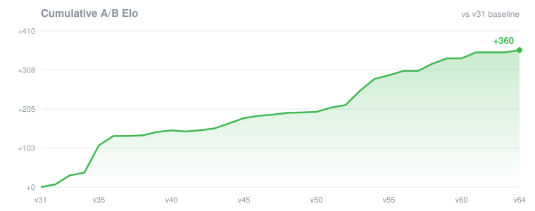
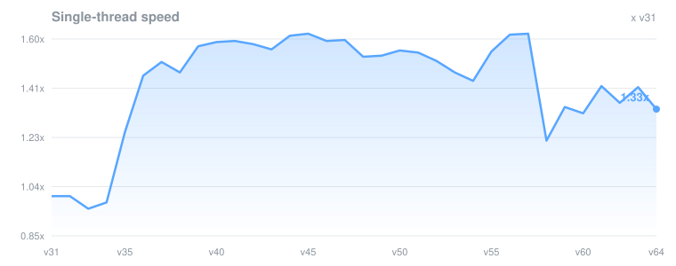

<div align="center">

# Pygin

**A from-scratch chess engine in Python + C.** The search is hand-written.
Since v58 the evaluation is an HCE/NNUE hybrid: the neural net scores positions
inside the main search, and the hand-crafted eval keeps quiescence. There is no
external engine, and the net learned from Pygin's own self-play games only, with
no borrowed data and no borrowed weights.<br/>
[`python-chess`](https://pypi.org/project/chess/) is used *only* for board
representation, move generation and legality.


&nbsp;·&nbsp; Built with **[Claude Code](https://claude.com/claude-code)**

</div>

### At a glance

| | | | |
|---|---|---|---|
| **~2868 Elo** | SF-18 UCI_Elo scale | **3.3M nps** | the net costs ~30% of it |
| **~+338 Elo** | A/B-confirmed, v31→v59 | **~18 ply** | from startpos in 5 s |
| **+19.11 Elo** | v58 NNUE, TIMED | **1.43x** | single-thread vs v31 |
| **v53+v54** eval lane | +37.52 & +31.20, the two biggest | **1 dependency** | `python-chess` only |

<table>
<tr>
<td></td>
<td></td>
</tr>
</table>

Both charts are self-play. Every C-era version (v31 and up) is A/B-tested against
the one before it, and the gains stack to about +338 Elo. Single-thread speed peaked
at 1.79× and sits at 1.43× today: v58 hands about 30% of it to the net and still
comes out +19.11 ahead. The v30→v31 C rewrite (~34× faster) is off the left
edge, so v31 is the honest zero.

The odds ladder against full-strength Stockfish is currently **unmeasured**.
Every rung on it was measured on a harness that erased Stockfish's won
endgames, so those figures have been withdrawn rather than footnoted; see
[Measured strength](#measured-strength).

### Two engines, one eval

`cengine.py` and `csearch.c` are the C search core, and the strongest engine
here. The whole per-node loop runs in C: board, ordering, TT, pruning,
quiescence, and since v58 the NNUE forward pass. Python keeps only the root,
which means iterative deepening, time management and the book. That is about
50× the Python core.

The eval is a hybrid. The net scores positions inside negamax, while qsearch
stand-pat stays on the hand-crafted eval. The split is deliberate: an earlier
all-NN attempt measured -203 to -273 Elo. `NNUE_REQUIRE_SIMD` keeps the net off
CPUs with neither NEON nor AVX2, where the scalar tail costs more than the eval
is worth.

`engine.py` is the reference Python engine, and the single source of
*hand-crafted* eval truth: the C core reads every HCE parameter from it at
startup. The net's weights live in `NNUE/nets/` instead.

### Measured strength

**~2868 Elo** on the SF-18 UCI_Elo scale, measured at v58 on 2026-08-08.

```
Score | 45.45% (454.5/1000)  ->  -31.70 +/- 21.7 vs the cap
Games | N: 1000  W: 235  L: 326  D: 439
Penta | [30, 153, 212, 88, 17]   500 pairs
Conf  | Stockfish 18 @ UCI_Elo 2900, 50+0.50, Threads=1, 4 workers
```

Caveats: this extrapolates from a single cap rather than a two-cap bracket,
and UCI_Elo is Stockfish's own limiter, not an external rating.

**This is the only strength figure on this page.** Everything previously
published here -- ~3010 at v58, ~2885 at v51, the whole odds ladder -- was
measured on a harness that accepted a threefold repetition that was merely
*available* rather than one that had occurred, and claimed the draw for
whichever side was about to convert. Against Stockfish that bias runs one way,
because Stockfish is the side with won endgames to grind. Fixed in `fc82cb7`.
Re-adjudicating the old games by evaluation predicted 46.0%; the re-run
measured 45.45%.

Those numbers have been removed rather than annotated. A retracted measurement
kept on the page with a footnote still gets quoted.

**Unmeasured, re-run pending:** the odds ladder (pawn, knight, rook, queen)
against full-strength SF-18, and the head-to-head against the Python engine.

The internal A/B ledger is not affected in the same way. Between two Pygins the
bug is near-symmetric, so it inflated draws and compressed effect sizes toward
zero: those numbers read low, not high.

---

## Version progression

58 versions, each A/B-tested against the one before it. Speed is nodes/s,
depth is from startpos in 5 s (book off, best-of-N), and `Elo Δ` is the A/B
result against the previous version. Cumulatively that is ≈ +338 over v31.

The list below has the full per-version speed, depth and Elo, and the charts
above summarise it. Regenerate both with `bench/bench_progress.py` and
`scripts/make_readme_charts.py`.

<details>
<summary><b>Every version in full</b> -- complete milestone + Elo list</summary>

- **v59** -- **lazy NNUE evaluation, and the first release measured as exactly the config that ships.** `LAZY_NNUE` is armed: the engine skips the net's forward pass wherever a cheap bound already decides the node, spending the saved time on more nodes (bench 1,074,820 -> **1,214,534**). The toggle was isolated for the first time -- same v4 net on both sides, nothing else different -- against `Old Engine/58` on the corrected harness. *(GSPRT[0,4] LLR **+2.950 ACCEPT** at 2,264 pooled pairs, TIMED 50+0.5 on x86, ptnml 69/509/975/595/116, pooled 51.99% -> **+13.84 ±6.4**, stopped early so the magnitude is bound-biased -- the verdict is the result. Historical note: v58's own +19.11 turned out to have been measured with this toggle ON while the release ran it OFF; v59 closes that gap by shipping what was measured.)*
- **v58** -- **the first HCE/NNUE hybrid, and the first net that pays.** `USE_NNUE` is armed on `nnue_v4_6f910e35bb1e.nnue`: the net replaces the hand-crafted eval inside negamax, while qsearch stand-pat stays HCE. Bench signature 1,145,629 -> **1,074,820**, and single-thread NPS drops roughly 30% to the SIMD tail, so the Elo below is measured *net* of that cost. The interesting part is what changed from v3, which read **+0.52 ±6.8** on this same instrument, i.e. nothing at all: not the dataset, not one dimension of the architecture, only the **learning-rate schedule**. Cosine in place of flat took held-out val 0.074417 -> 0.066663, and that is the whole gain; identical dimensions mean identical speed, so none of it is bought with nodes. `NNUE_REQUIRE_SIMD` keeps the net off scalar builds, where the ~3x slower tail would make the engine *worse*. *(**+19.11 ±7.8** over 3,404 games TIMED 50+0.20 on x86, GSPRT[0,4] LLR **+2.950 ACCEPT** at 1,702 pairs, ptnml 71/358/691/477/105 -- sixth SPRT accept, and the second-largest release after the v53 Texel retune. An arm64 confirmation is owed: v3 read +5.70 ±4.6 there against +0.52 here, so the architecture spread is real and only x86 has been measured for v4)*
- **v57** -- **the last pure-HCE release**; from here Pygin is an HCE/NNUE hybrid. Host layer only and **node-identical** to v56 (bench signature 1,145,629 unchanged, ladder node-exact), so no A/B slot was spent and the ledger is untouched. **Ponderhit now honours the soft-stop** -- a prediction hit used to spend the full fresh budget re-confirming an already-settled move; it now applies the same P-35/U-06 fractions the main search uses (1.666 s → 0.686 s, a ratio of 0.412 against the designed 0.40). The soft-stop neighbourhood is exposed over UCI (`SoftStop`, `SoftStopStable`, `SoftStopUnstable`, `SoftStopStableIters`) so it can be swept without a rebuild. And a latent bug is fixed: `cuci.py` restored a *hardcoded* 0.55 soft-stop fraction over whatever the engine set, which meant any future tuning would have worked in testing and been silently discarded in every real game.
- **v56** -- **ProbCut**: the fail-high half of forward pruning, which Pygin had no equivalent of. At a shallow non-PV node a qsearch filters each capture at `beta + 200` and a real reduced-depth search confirms before anything is cut, so nothing is ever pruned on a static score. Cuts **21.6% of nodes** at fixed depth (bench 1,461,732 → 1,145,629). *(**+11.44 ±6.9** over 5,924 games TIMED 50+0.20, GSPRT[0,4] LLR **+2.953 ACCEPT** -- the ledger's own instrument; the `--nodes` campaign that shipped it read **+4.11 ±4.2** over 21,806 games (LLR +2.971), so the fixed-node instrument reads CONSERVATIVE. Fifth SPRT accept, and the first pruning MECHANISM to pay since the search lane was declared exhausted: what was exhausted was the parameter space, not the mechanism space)*
- **v55** -- **node-identical speed pair**: FI-11 pin-aware legality + FI-42 the (mg,eg,phase) accumulator on Board. Bench signature UNCHANGED at 1,461,732, perft --deep clean, ladder node-exact -- the search plays the SAME moves, it just gets there faster: **+8.3% NPS on x86, +13.5% on arm64**. *(**+9.66 ±8.2** over 6,874 games, TIMED 50+0.20, GSPRT[0,4] LLR +2.946 ACCEPT -- measured on the clock because a fixed-node instrument reads zero for a node-identical change; **~1.16 Elo per 1% NPS**)*
- **v54** -- **PST retune** (736 piece-square entries fitted for the first time, texel.py --pst, 735 values moved; GSPRT[0,2] LLR +7.806, 11.7k games -- second-largest release) *(**+31.20 ±5.6**)*
- **v53** -- **Texel eval retune** (44 scalars refitted on 4M own-self-play positions, game-result labels; fourth SPRT accept, LLR +9.918, 12k pooled games -- largest single release) *(**+37.52 ±6.3**)*
- **v52** -- null-move refinements (no double null + eval-scaled R; third SPRT accept, 12k pooled games) *(+6.63 ±4.5)*
- **v51** -- root-move LMR (late quiet root scouts reduced; second SPRT accept, 9.3k pooled games) *(+11.12 ±5.3)*
- **v50** -- rule50 TT staleness guard + depth-independent TT mate handling (permanent terminal entries; null kept as correctness) *(+1.60 ±6.8)*
- **v49** -- cuckoo upcoming-repetition (forcible draw scored one ply early; null kept as correctness) *(+0.97 ±6.8)*
- **v48** -- qsearch TT-quality batch (TT value sharpens stand-pat; first SPRT accept, 21.6k games) *(+4.73 ±3.2)*
- **v47** -- TT to 192 MB (diminishing) + MultiPV (node-exact off) *(+3.16 ±6.8)*
- **v46** -- transposition table doubled to 96 MB (borderline; less TT thrash per game) *(+5.94 ±6.8)*
- **v45** -- TT search value sharpens the pruning eval (same NPS, smarter cuts) *(+13.52 ±6.8)*
- **v44** -- TT prefetch (node-identical, +5–6 % NPS) *(+13.31 ±6.8)*
- **v43** -- verified-null REMOVED (the insurance cost ~1 ply; isolation A/B) *(+5.18 ±6.8)*
- **v42** -- cannot-win eval clamp (correctness) *(+3.27 ±6.8)*
- **v41** -- verified null + 50-move + TT-store policy (correctness) *(-2.88 ±6.8)*
- **v40** -- FIDE-exact en-passant hashing (correctness) *(+4.31 ±6.8)*
- **v39** -- incremental Zobrist + eval-in-TT + NPS batch *(+8.86 ±6.8)*
- **v38** -- score-hygiene batch (correctness) *(+1.36 ±6.8)*
- **v37** -- exact PV (correctness) *(+0.17 ±6.8)*
- **v36** -- staged move ordering *(+24.67 ±6.8)*
- **v35** -- noisy-only qsearch gen + qsearch TT *(≈ +72)*
- **v34** -- check extensions *(+6.81 ±6.8)*
- **v33** -- transposition table kept warm across moves *(+23.52 ±6.8)*
- **v32** -- internal iterative reduction *(+7.30 ±6.8)*
- **v31** -- **C search core** (whole per-node loop in C) *(29W/1D/0L gate ¹)*
- **v30** -- stability-scaled time (U-06); last Python *(+10.91 ±6.8)*
- **v29** -- soft-stop time management (P-35) *(+38.34 ±6.9)*
- **v28** -- node-identical speed batch (+4 %) *(+13.13 ±6.0)*
- **v27** -- node-identical speed batch (+12 %) *(+35.17 ±7.7)*
- **v26** -- node-identical speed batch *(+41.90 ±5.7)*
- **v25** -- 18-item bug block; Lazy-SMP production fixes *(+2.91 ±11.6)*
- **v24** -- TT-dispatch de-branching (± is the v21→v24 span) *(+11.75 ±6.8 ²)*
- **v23** -- Zobrist dispatch de-branching (code quality) *(≈ +0 est ²)*
- **v22** -- nine correctness bug fixes + six NPS wins *(≈ +8 est ²)*
- **v21** -- capture history, SEE capture pruning, LMR losing captures *(+16 ±10 ⁴)*
- **v20** -- rook-on-7th, mobility area, threats; one-call C eval *(+45 ±11 ⁴)*
- **v19** -- lock-free shared TT, multi-process SMP, packed move word *(≈ +5 est ⁵)*
- **v18** -- incremental Zobrist hashing (off by default; SMP infra) *(≈ +0 est ⁵)*
- **v17** -- **move generation ported to C** (`movegen.c`) *(+69 ±16 ³)*
- **v16** -- **evaluation ported to C** (`eval_c.c`) *((in ³))*
- **v15** -- LMR-divisor tune (tie); probcut tried & removed *(≈ +0 est ⁵)*
- **v14** -- Syzygy TB probe, internal iterative reduction, pawn hash *(≈ +8 est ⁵)*
- **v13** -- eval-weight retune *(≈ +4 est ⁵)*
- **v12** -- check-extension budgeting + max-extensions cap *(≈ +4 est ⁵)*
- **v11** -- incremental base eval (byte-identical) *(≈ +3 est ⁵)*
- **v10** -- TT refactor (two-tier + depth-preferred replacement) *(≈ +8 est ⁵)*
- **v9** -- late-move pruning, history malus, improving heuristic *(≈ +12 est ⁵)*
- **v8** -- quiescence stand-pat, trade-down simplify, PV extraction *(≈ +12 est ⁵)*
- **v7** -- pin evaluation *(≈ +4 est ⁵)*
- **v6** -- lone-king endgame eval fix *(≈ +8 est ⁵)*
- **v5** -- recapture extension *(≈ +3 est ⁵)*
- **v4** -- SEE move ordering + losing-capture pruning *(≈ +20 est ⁵)*
- **v3** -- endgame mop-up, contempt draws, counter-moves *(≈ +15 est ⁵)*
- **v2** -- search + eval build-out: PVS, futility, LMR, aspiration, pawn/mobility/king-safety eval, book *(≈ +120 est ⁵)*
- **v1** -- first working engine (naive negamax + material eval) *(--)*

</details>

<details>
<summary><b>Reading the table</b> (footnotes & caveats)</summary>

- **Elo Δ** is the A/B vs the previous version (C-era = 10,000 games). It is
  not summable across the whole column, because the TCs differ (Python era
  assorted ⁴, v32–36 at 45+0.10, v37–47 at 50+0.20, v48+ on `--nodes`).
- **`est` ⁵** is a feature-based estimate, not an A/B. The real anchor is ≈2442
  by v25.
- **Bundled A/Bs:** v16+v17 vs v15 = +69 ±16 ³; v22–24 vs v21 = +11.75 ±6.8 ².
  v31's ≈+215 ¹ was odds-derived and is **withdrawn** -- the odds ladder it came
  from was measured on the pre-`fc82cb7` harness. The v30→v31 gate (29W/1D/0L
  over 30 games) stands on its own: the jump was past what Elo could express.
- **NPS 4T** is "--" for v1–24 (no reliable SMP). v25–30 were multi-process,
  v31+ pthread Lazy-SMP, so the v30→v31 jump is partly methodology.

</details>

### The biggest jumps

| Jump | NPS | What |
|---|---|---|
| **v15→v17** | 28.7k → 52.7k | eval, then movegen ported to C (byte-identical) |
| **v25→v28** | 49.1k → 69.0k | node-identical speed batches |
| **v30→v31** | 69.0k → **2.34M (~34×)** | whole per-node loop moves to C |
| **v34→v36** | 2.13M → 3.19M | noisy-only qsearch gen + staged ordering |
| **v43→v44** | 3.23M → 3.67M | TT prefetch: +13.31 Elo, ~2.7 Elo per 1% NPS |
| **v53** | -- | Texel eval retune: +37.52 Elo, biggest single release |
| **v54→v55** | 3.69× → **4.19×** | pin-aware legality + eval accumulator: +9.66 Elo, ~1.16 Elo per 1% NPS |
| **v55→v56** | **4.19×** | ProbCut: **+11.44 timed** (+4.11 on `--nodes`) at -21.6% nodes; S-06 pool +9.83% at 4 threads |
| **v56→v57** | **4.19×** | host layer only, node-identical: ponderhit soft-stop + the time-policy knobs over UCI. **Last pure-HCE release** |
| **v57→v58** | **~2.9×** | NNUE armed: **+19.11 timed** while GIVING BACK ~30% NPS to the net. First hybrid; the gain is the training schedule, not the architecture |

*Not visible as NPS:* v39→v40 (ep-key merge) and the v41→v43 verified-null
removal are nodes-to-depth gains at flat speed.

---

## Features

- Search: negamax/alpha-beta, PVS, iterative deepening, aspiration windows,
  transposition table, quiescence.
- Selectivity: null-move, reverse-futility and futility pruning, LMR + LMP,
  check / single-reply / passed-pawn extensions.
- Move ordering: TT move, MVV-LVA + capture history, killers, counter-moves,
  history heuristic, SEE.
- Evaluation: tapered HCE (material + PSQT, pawn structure, king safety,
  mobility, rook files, bishop pair, threats, endgame mop-up), ported to C.
- C internals: magic-bitboard movegen reproducing python-chess's order
  byte-for-byte, the whole per-node search loop in C, and a bit-exact eval port
  verified over 3M positions.
- Lazy SMP: pthreads + lock-free shared TT (UCI `Threads`); the Python engine
  has a multi-process variant.
- Optional: bundled Polyglot book (`Perfect2023.bin`), online Syzygy probing.

---

## Setup

```bash
git clone https://github.com/IchNukeDichWeg/Pygin.git
cd Pygin
./setup.sh
```

`setup.sh` installs anything missing (Homebrew on macOS, apt/dnf/pacman/zypper
on Linux), builds the C libraries, best-effort builds the `Old Engine/`
snapshots, and self-tests.

Needs Python 3.10+, a C compiler (`clang`/`gcc`), `python-chess` (the only
dependency), and Stockfish if you want strength/odds testing.

```bash
python3 selftest.py        # health check; exit 0 = OK, chainable
```

> **Isolated install:** `python3 -m venv .venv && source .venv/bin/activate`, then `./setup.sh`.
> **Windows:** build a Unix `.so`, so use [WSL](https://learn.microsoft.com/windows/wsl/install) (`wsl --install`) or Git Bash / MSYS2.
> **Rebuild C by hand:** `python3 scripts/eval_build.py && python3 scripts/movegen_build.py` (for `csearch.so`, re-run `./setup.sh`).

---

## Running a headless match

`match.py` plays engine-vs-engine, prints a live scoreboard + Elo, and writes a
per-game log and PGN.

```bash
# C search core vs a saved snapshot: 100 positions (×2 colours), every core
python3 match.py cengine.py "Old Engine/34/engine34.py" 100 0 --workers 0
```

- Positional args are `engine1 engine2 NUM_POSITIONS OFFSET`. Each position is
  played both colours, so games = `NUM_POSITIONS × 2`.
- Flags: `--workers 0` = cores-1, `--adj on|off` adjudication, `--sf-elo N`,
  `--smp N`, `--book1/--book2 PATH`, `--start-pos True`.
- Openings default to the bundled `UHO_4060_v4.epd`. Larger sets are in the
  [Stockfish books repo](https://github.com/official-stockfish/books); point
  `FEN_FILE` at one.

**vs Stockfish** (binary on `PATH`):

```bash
python3 match.py engine.py stockfish_engine.py 100 0 --sf-elo 2000   # 0 = full strength
```

**Material / time odds** are configured in `odds.py`'s `CONFIG` block (the
default is pawn odds, `f2`). The opponent is **full-strength SF-18** -- that is
what the ladder means, and a capped opponent measures something else that no
recorded rung can be compared to. Each worker runs two engines, so `--workers 0`
here means cores/2, not cores-1 -- a real clock TC gets starved by
oversubscription, and a Stockfish opponent squeezed to 10k nps stops being the
yardstick the run is quoting:

```bash
python3 odds.py --positions 500 --workers 0
```

---

## UCI options

`cuci.py` is the UCI engine (`setoption name <Option> value <x>`). Standard
GUI options:

| Option | Type | Default | Range | Purpose |
|:-------|:-----|--------:|:------|:--------|
| `Threads` | spin | 1 | 1–512 | Lazy-SMP search threads. The ceiling is a limit, not advice: set it above your PHYSICAL core count and threads timeshare cores, which costs strength rather than adding it |
| `Hash` | spin | 192 | 2–24576 | Transposition-table size (MB); resize wipes the table. The entry count is a power of two of 24-byte entries, so the sizes near the top are **6144 / 12288 / 24576** -- anything between rounds DOWN to one of them, and an info string names the next size up. **Raise it for long games or analysis:** at 50+0.20 the default fills completely by move 16 and every later store evicts something. The default is deliberately modest because A/B harnesses run two engine processes per worker, each allocating its own table |
| `MultiPV` | spin | 1 | 1–20 | PV lines reported. >1 is an analysis mode: it bypasses the book and is never active in match play |
| `OwnBook` | check | true | -- | Use opening book |
| `BookFile` | string |  | -- | Path to Polyglot `.bin` book (empty ⇒ bundled `Perfect2023.bin`) |
| `UseTB` | check | false | -- | Probe the online Lichess Syzygy tablebase at the root (needs network; no local path) |
| `Move Overhead` | spin | 40 | 0–5000 | Clock margin (ms) for GUI/network lag |
| `Premove` | check | false | -- | Emit certified instant-reply premoves (opt-in) |
| `UCI_ShowWDL` | check | true | -- | Emit `wdl` on info lines (opt-out for strict arenas) |
| `Clear Hash` | button | -- | -- | Wipe the transposition table without `ucinewgame` |
| `Contempt` | spin | 50 | -100–100 | Draw score bias (cp) when ahead/behind |

---

## Tooling

| Script | Purpose |
|---|---|
| `testing/perft.py` | Move-generator correctness gate vs the published Perft results (`--deep` for the full 1.5 B-node suite). |
| `bench/profile_bench.py` | Real NPS + a per-function bottleneck breakdown in one pass (`--graph` for an HTML report). |
| `bench/nps_history_bench.py` | NPS / depth benchmark across the `Old Engine/` snapshots. |
| `bench/benchmark.py` | NPS / depth / nodes benchmark for the C search core (`--type`, `--threads`, `--hash`, averaged over `--runs`). |
| `cuci.py` | UCI host for the C search core (`Threads` / `OwnBook` / `UseTB` options). |
| `tuning/fit_wdl_model.py` | Fit the win/draw/loss model from match logs (`data/wdl_model.json`; `wdl.py` reads it). |

---

## Project layout

```
engine.py              the reference Python engine (search + eval orchestration)
cengine.py             root driver for the C search core (the strongest engine)
csearch.c              the whole per-node search loop in C (built to .so)
eval_c.c / movegen.c   C evaluation and move generation (built to .so)
Constants.c/.h         magic-bitboard + attack tables (linked into the .so files)
cuci.py                UCI host for the C search core
match.py               headless engine-vs-engine match runner
battle_worker.py       per-game worker process used by match.py
stockfish_engine.py    UCI adapter exposing Stockfish through the same API
odds.py                material / time-odds match runner
Old Engine/<N>/        frozen version snapshots (engineN.py + its C sources)

lib/                   shared support modules: time_manager (clock budgets),
                       wdl (W/D/L model reader), interruptible (Ctrl-C/SIGTERM
                       salvage), smp + shared_tt (the PYTHON engine's
                       multi-process Lazy SMP and its lock-free shared TT)
data/                  opening books, EPD position sets, the fitted WDL model
docs/                  design notes, OpenBench guide, third-party licences
tuning/                texel.py and the eval-fitting tools
bench/                 NPS / depth / profiling harnesses
testing/               perft, SPRT, one-off correctness gates
scripts/               build, release, export and generator scripts
```

`Old Engine/<N>/` holds every historical version, each self-contained. See
its [README](Old%20Engine/README.md).

---

## Notes

- C `.so` files are not committed. They are platform-specific and built by
  `setup.sh`.
- If a `.so` won't load, the engine falls back to pure Python (correct, slower);
  the self-test reports which path is active.

## License

- **Source:** MIT -- see [`LICENSE`](LICENSE).
- **Released binaries** bundle [`python-chess`](https://github.com/niklasf/python-chess)
  (GPL-3.0+), so the binary distribution is GPL-3.0 as a whole. Full text,
  source pointers and credits (Perfect2023 book -- Sedat Canbaz; UHO suites --
  Stefan Pohl) in [`THIRD_PARTY_LICENSES.md`](docs/THIRD_PARTY_LICENSES.md).
